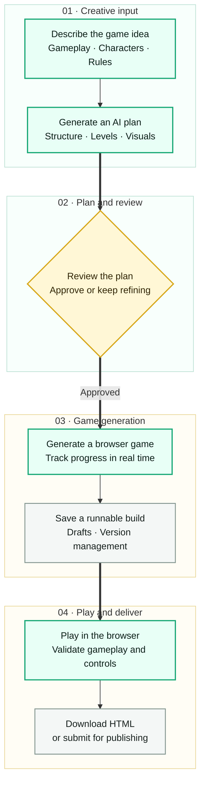

# GameForge

  <a href="README.md">简体中文</a> · <strong>English</strong>

> Use natural language to turn a game idea into a browser-ready experience that can be played, managed, and delivered.

  

  <a href="https://htmlpreview.github.io/?https://raw.githubusercontent.com/ByteTitan-star/GameForge-Copilot/docs/readme-redesign/docs/showcase/index.html?lang=en">Open product showcase</a>
  &nbsp;·&nbsp;
  <a href="https://htmlpreview.github.io/?https://raw.githubusercontent.com/ByteTitan-star/GameForge-Copilot/docs/readme-redesign/docs/showcase/index.html?lang=en#watch">Watch game showcases</a>

## What is GameForge?

GameForge is an AI-assisted workspace for creating browser games. Creators start with a gameplay description, move through AI planning, human review, and game generation, then receive a browser game they can play immediately, manage as versions, download, or publish.

## Product flow

## Created game showcase

### Pixel Runner

A neon gravity runner. Press Space or click to reverse gravity, avoid obstacles, and build your score.

### Tower Defense Prototype

A colorful tower defense prototype. Place defensive towers, stop enemy waves, and track level progress.

## Product interface

| Forge workspace | Browser playtest |
| --- | --- |
|  |  |
| Describe an idea, review the AI plan, and confirm the generation direction. | Open the generated result and validate the gameplay and controls directly. |

## Product capabilities

| Create and generate | Manage and deliver |
| --- | --- |
| **AI planning with human review** Turn natural-language requirements into a game plan that can be reviewed. | **Versions and game library** Manage drafts, previous versions, and public creations in one place. |
| **Browser game generation** Generate a directly runnable game with live progress feedback. | **Play, download, and publish** Play in the browser, download standalone HTML, or submit for publishing. |
| **End-to-end creation flow** Move continuously from an initial idea to a playable game result. | **Discovery and interaction** Discover, favorite, like, and share more game creations. |

## Expanding next

- Iterate on an existing game through conversation.
- Upload custom character, background, and audio assets.
- Add more game genres, templates, and creation capabilities.

  <strong>Experience the complete product flow</strong>  
  <a href="https://htmlpreview.github.io/?https://raw.githubusercontent.com/ByteTitan-star/GameForge-Copilot/docs/readme-redesign/docs/showcase/index.html?lang=en">Open the online product showcase</a>
  &nbsp;·&nbsp;
  <a href="https://htmlpreview.github.io/?https://raw.githubusercontent.com/ByteTitan-star/GameForge-Copilot/docs/readme-redesign/docs/showcase/index.html?lang=en#watch">Watch the game showcase video</a>

## License

[MIT](LICENSE)
