# GameForge

  <a href="README.md">简体中文</a> · <strong>English</strong>

> Turn a browser game idea into a playable build with natural language.

  

  <a href="docs/showcase/assets/gameforge-demo.mp4">View game showcases</a>
  &nbsp;·&nbsp;
  <a href="https://htmlpreview.github.io/?https://raw.githubusercontent.com/ByteTitan-star/GameForge-Copilot/docs/readme-redesign/docs/showcase/index.html?lang=en">Open product showcase</a>

## What is GameForge?

GameForge is an AI-assisted workspace for creating browser games. Creators describe a game idea, review an AI-generated plan, confirm the direction, generate the game, and play it directly in the browser. Generated games can also be managed, downloaded, or submitted for publishing from the game library.

## Product flow

```mermaid
flowchart LR
    subgraph S1["01 · Creative input"]
        A["Describe the game idea<br/>Gameplay · Characters · Rules"]
    end

    subgraph S2["02 · Plan and review"]
        B["Generate an AI plan<br/>Gameplay · Levels · Visuals"]
        C{"Review the plan"}
        B --> C
        C -.->|Keep refining| B
    end

    subgraph S3["03 · Game generation"]
        D["Generate a browser game<br/>Track progress in real time"]
        E["Save a runnable build<br/>Drafts · Version management"]
        D --> E
    end

    subgraph S4["04 · Play and deliver"]
        F["Play in the browser<br/>Validate the gameplay directly"]
        G["Download HTML<br/>or submit for publishing"]
        F --> G
    end

    A ==> B
    C ==>|Approved| D
    E ==> F

    classDef primary fill:#e8fff6,stroke:#18a875,stroke-width:2px,color:#092018
    classDef decision fill:#fff7d6,stroke:#d7a719,stroke-width:2px,color:#332600
    classDef output fill:#f4f7f6,stroke:#83958f,stroke-width:1.5px,color:#17211e
    class A,B,D,F primary
    class C decision
    class E,G output
    style S1 fill:#f8fffc,stroke:#b7ded0,stroke-width:1px
    style S2 fill:#f8fffc,stroke:#b7ded0,stroke-width:1px
    style S3 fill:#fffdf5,stroke:#e6d28d,stroke-width:1px
    style S4 fill:#fffdf5,stroke:#e6d28d,stroke-width:1px
```

| Stage | Key action | Stage output |
| --- | --- | --- |
| Creative input | Describe the gameplay, characters, and rules in natural language in the Forge workspace. | A clear gameplay brief |
| AI planning | Turn the creative direction into a game design that can be reviewed and confirmed. | A structured design plan |
| Human review | Review the direction before generation and continue refining it when needed. | An approved generation plan |
| Game generation | Turn the plan into a runnable browser game with live progress feedback. | A manageable game version |
| Browser playtest | Open the game directly and validate the gameplay and controls. | Real playtest feedback |
| Download or publish | Download a standalone HTML build or submit the game for publishing. | A deliverable game |

## Created game showcase

### Pixel Runner

A neon gravity runner. Press Space or click to reverse gravity, avoid obstacles, and build your score.

### Tower Defense Prototype

A colorful tower defense prototype. Place defensive towers, stop enemy waves, and track level progress.

## Product interface

| Home | Forge workspace | Browser playtest |
| --- | --- | --- |
|  |  |  |

These interfaces show the creation entry point, the game design workspace, and the in-browser playtest experience.

## Product capabilities

- Describe game requirements in natural language and receive an AI-generated game plan.
- Confirm the design direction before generation and stay in control of the creative process.
- Generate browser-ready game versions with live progress feedback.
- Manage drafts, versions, and public works in the game library.
- Play in the browser, download standalone HTML builds, or submit games for publishing.
- Discover, favorite, like, and share game creations.

## Game showcase video

The included [game showcase video](docs/showcase/assets/gameforge-demo.mp4) presents Pixel Runner and Tower Defense running in the browser.

## What's next

- Iterate on an existing game through conversation.
- Upload custom character, background, and audio assets.
- Add more game genres, templates, and creation capabilities.

## Visual showcase

Open the [online product showcase](https://htmlpreview.github.io/?https://raw.githubusercontent.com/ByteTitan-star/GameForge-Copilot/docs/readme-redesign/docs/showcase/index.html?lang=en) to explore the product flow, created games, and interface experience. Use the language switcher in the upper-right corner to change between English and Chinese.

## License

[MIT](LICENSE)
