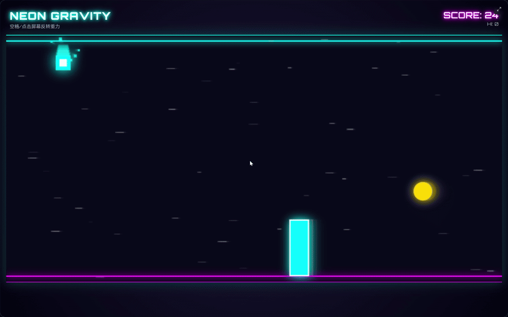

<h1 align="center">🎮 GameForge</h1>

  
  
  
  
  

> Use natural language to turn a game idea into a playable browser game —
> from single-file HTML to Vite/React and Phaser projects — then iterate,
> playtest, and publish.

  

  <a href="https://htmlpreview.github.io/?https://raw.githubusercontent.com/ByteTitan-star/GameForge-Copilot/main/docs/showcase/index.html?lang=en">Open product showcase</a>
  &nbsp;·&nbsp;
  <a href="https://htmlpreview.github.io/?https://raw.githubusercontent.com/ByteTitan-star/GameForge-Copilot/main/docs/showcase/index.html?lang=en#watch">Watch game showcases</a>

## What is GameForge?

GameForge is an AI-assisted workspace for creating browser games. Creators start with a gameplay description and the agent plans, generates, and playtests autonomously — asking one focused question only when a decision-critical preference is unknown, then deciding directly from remembered preferences — delivering a playable result in the browser — whether as a compact HTML build or a Vite project (React UI, Canvas / Phaser / PixiJS, and more) — and can keep managing versions, downloading, or publishing.

## Product flow

| Stage | Key action | Stage output |
| --- | --- | --- |
| Creative input | Describe the gameplay, characters, and rules in natural language in the Forge workspace. | A clear gameplay brief |
| AI planning | Turn the creative direction into a game design that can be reviewed and confirmed. | A structured design plan |
| On-demand clarification | When a decision-critical preference is unknown, the agent asks one focused question via the `ask_user` tool and remembers the answer; otherwise it decides directly from your preference memory. | A clarified decision, saved for next time |
| Game generation | Turn the plan into a runnable browser game with live progress feedback. | A manageable game version |
| Browser playtest | Open the game directly and validate the gameplay and controls. | Real playtest feedback |
| Download or publish | Download a standalone HTML build or submit the game for publishing. | A deliverable game |

## Created game showcase

### Pixel Runner

A neon gravity runner. Press Space or click to reverse gravity, avoid obstacles, and build your score.

### Tower Defense Prototype

A colorful tower defense prototype. Place defensive towers, stop enemy waves, and track level progress.

## Product interface

| Forge workspace | Browser playtest |
| --- | --- |
|  |  |
| Describe an idea, watch the agent plan and generate, and answer a clarifying question only when asked. | Open the generated result and validate the gameplay and controls directly. |

## Core features

| Core feature | Description |
| --- | --- |
| Natural-language driven | Start creating by describing the gameplay instead of writing code. |
| Autonomous agent, memory-first | The agent plans and generates end to end, deciding from your saved preferences and asking a question only when a decision is truly ambiguous ([ADR-18](docs/adr/ADR-18-native-tool-hitl-no-fixed-gates.md)). |
| Preference memory | Long-term taste (style, difficulty, language, genre) is captured from your requests and answers and applied to every future creation. |
| Flexible game stacks | Generate single-file HTML or Vite projects with React UI and engines such as Canvas, Phaser, and PixiJS. |
| Browser native | Open and play generated results immediately without extra installation. |
| Deliverable builds | Download, save, and share playable browser builds. |
| Traceable versions | Manage drafts, previous versions, and public creations in one place. |
| Creation ecosystem | Publish, discover, favorite, like, and share game creations. |

  <strong>Experience the complete product flow</strong>  
  <a href="https://htmlpreview.github.io/?https://raw.githubusercontent.com/ByteTitan-star/GameForge-Copilot/main/docs/showcase/index.html?lang=en">Open the online product showcase</a>
  &nbsp;·&nbsp;
  <a href="https://htmlpreview.github.io/?https://raw.githubusercontent.com/ByteTitan-star/GameForge-Copilot/main/docs/showcase/index.html?lang=en#watch">Watch the game showcase video</a>

## License

MIT © CodeTitan, 2026 — see [LICENSE](LICENSE).
