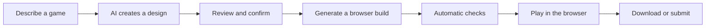

# GameForge

**English** | [简体中文](README.zh-CN.md)

<p align="center">
  <a href="docs/assets/readme/gameforge-demo.mp4">
    
  </a>
</p>

<p align="center">
  <strong>Describe a browser game, review the design, generate a build, and play it in the browser.</strong>
</p>

> The current product interface is available in Simplified Chinese. The English README documents the same product and does not imply that an English UI is available.

## Product Demo

The included media shows the product and the playable games currently available in the official library:

- **Home page GIF**: an animated preview of the Chinese GameForge home page.
- **Pixel Runner**: a neon-gravity runner with keyboard interaction, jumping, score progression, failure, and restart feedback.
- **Tower Defense**: a playable tower-defense prototype with tower placement, enemy waves, and wave-clear feedback.

Watch the [full product recording](docs/assets/readme/gameforge-demo.mp4). The recording focuses on real browser gameplay from the official library; it is not a capture of the prompt-to-generation wait sequence.

## What Is GameForge?

GameForge is an AI-assisted workspace for creating browser games. A creator can describe a game idea, review the generated design, generate a self-contained browser build, and play the result without leaving the product.

The current product also supports managing game drafts and versions, previewing a generated version in an isolated page, downloading an owned version as a standalone HTML file, and submitting a version for publishing review.

## Key Features

- **Natural-language game creation**: describe a game idea in the Forge workspace.
- **AI planning with human review**: inspect and confirm the generated design before building.
- **Playable game generation**: generate a self-contained browser game and run automatic checks.
- **Browser preview and play**: open private drafts or published games inside GameForge.
- **Persistent Forge conversation**: return to a game without losing its Forge message history.
- **Version download**: download an owned generated version as a standalone HTML file.
- **Publishing and library management**: manage drafts, submissions, and published games through the review workflow.
- **Generated covers**: when browser playtesting is enabled in the Worker runtime, a captured gameplay thumbnail can be used as a game cover.

## How It Works



The generation pipeline plans the game, selects built-in assets, generates code, and validates the result. To try the Forge generation flow locally, configure an LLM provider after startup. The media above demonstrates the separate browser gameplay experience.

## Quick Start

### Prerequisites

- Docker Desktop with Docker Compose
- Node.js 20+ and pnpm 9+
- [uv](https://docs.astral.sh/uv/) (installs the required Python 3.12 runtime)

### 1. Create local configuration

```bash
cp backend/.env.example backend/.env
cp frontend/.env.example frontend/.env
```

Keep the local defaults for a first run. Never commit either `.env` file.

### 2. Start dependencies and initialize the backend

```bash
docker compose up -d postgres redis rabbitmq

cd backend
uv sync
uv run alembic upgrade head
uv run python -m scripts.seed_official_games
```

### 3. Start the API, Worker, and frontend

Open three terminals from the repository root:

```bash
# Terminal 1
cd backend
uv run uvicorn app.main:app --reload --host 127.0.0.1 --port 8000
```

```bash
# Terminal 2
cd backend
uv run python -m app.messaging.worker
```

```bash
# Terminal 3
cd frontend
pnpm install
pnpm run dev
```

Open [http://127.0.0.1:5173](http://127.0.0.1:5173). To generate a game, register and verify an account, then add a working LLM provider in Settings. With the default local email configuration, the verification code is printed in the Worker terminal.

For environment variables, Docker-backed backend mode, Windows troubleshooting, health checks, and test commands, read [docs/development.md](docs/development.md).

## Architecture

| Layer | Current implementation |
| --- | --- |
| Web client | React, TypeScript, Vite |
| API | FastAPI |
| Primary data | PostgreSQL |
| Cache and checkpoints | Redis |
| Background work and real-time events | RabbitMQ and a Worker process |
| Generation orchestration | LangGraph |
| Model access | User-configured LLM providers |
| Build isolation | Local or Docker Sandbox Backend, with optional Playwright browser playtest and cover capture |

## Project Structure

```text
frontend/   React application and browser-side tests
backend/    FastAPI API, generation graph, Worker, migrations, and tests
contracts/  OpenAPI contract and integration notes
docs/       Development documentation and README media
```

## Development Documentation

- [Local development, configuration, and troubleshooting](docs/development.md)
- [API contract and integration notes](contracts/INTEGRATION.md)
- [API changelog](contracts/CHANGELOG.md)

## Roadmap

- [ ] Conversational iteration of an existing game
- [x] Switch an owned game back to an existing version
- [ ] Upload custom game assets
- [ ] Support a broader range of game genres and templates

The roadmap separates planned work from the functionality currently available on `main`.

## Contributing

Keep changes small and focused. Update the OpenAPI contract when an API changes, add focused tests for behavior changes, and avoid mixing unrelated product work into one pull request. See [docs/development.md](docs/development.md) before starting local development.

## License

[MIT](LICENSE)
