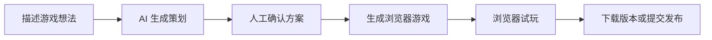
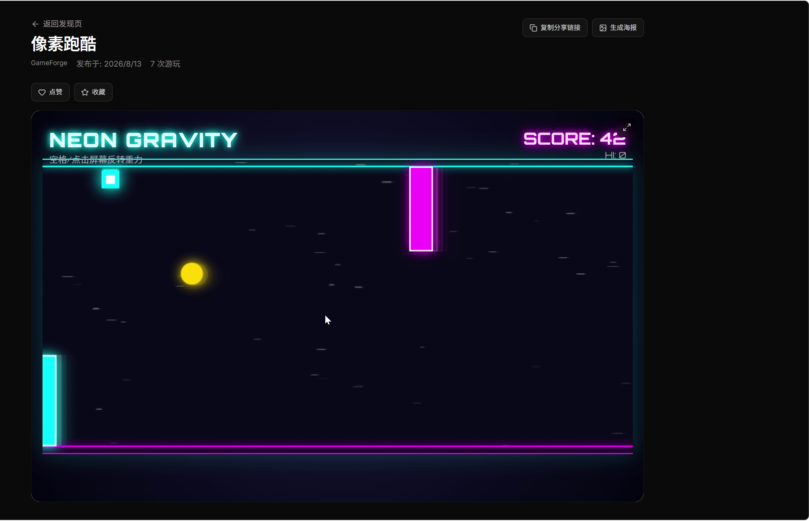
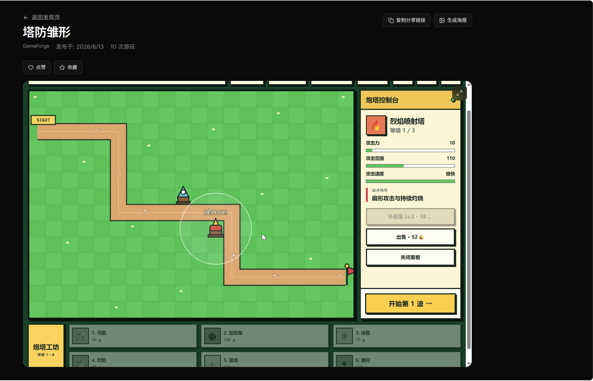

# GameForge

**简体中文**

> 用自然语言把一个浏览器游戏从想法推进到可试玩版本。

<p align="center">
  <a href="docs/showcase/index.html">
    
  </a>
</p>

<p align="center">
  <a href="docs/showcase/assets/gameforge-demo.mp4">观看完整录屏（MP4）</a>
  &nbsp;·&nbsp;
  <a href="docs/showcase/index.html">打开可视化产品展示页</a>
</p>

## GameForge 是什么

GameForge 是一个面向浏览器游戏的 AI 辅助创作工作区。创作者描述游戏想法后，可以查看 AI 给出的策划、确认方案、等待生成完成，并在浏览器内直接试玩结果。生成后的游戏可在游戏库中管理、下载自己的版本，或进入发布审核流程。

当前产品界面为简体中文。本 README 只描述当前 `main` 分支实际存在的能力；录屏展示的是已经发布、可实际操作的游戏 Demo，不把录屏之外的内容写成已完成。

## 产品链路



| 阶段 | 当前状态 | 说明 |
| --- | --- | --- |
| 描述想法 | 已实现 | 在 Forge 工作区用自然语言说明玩法需求。 |
| AI 策划 | 已实现 | 生成前会输出可供查看的设计方案。 |
| 人工确认 | 已实现 | 方案确认后才继续后续生成流程。 |
| 生成游戏 | 已实现 | Worker 执行生成、校验与进度事件处理。 |
| 浏览器试玩 | 已实现 | 草稿与已发布游戏均可在浏览器中打开试玩。 |
| 下载或发布 | 已实现 | 本人版本可下载为独立 HTML；发布进入审核工作流。 |

## 真实 Demo

### 像素跑酷



录屏中的霓虹重力跑酷：空格或点击反转重力，避开障碍并累计分数。启动本地服务后，可访问 `http://127.0.0.1:5173/play/official-pixel-runner` 查看示例。

### 塔防雏形



录屏中的卡通塔防原型：放置防御塔、拦截敌人波次，并观察关卡进度。启动本地服务后，可访问 `http://127.0.0.1:5173/play/official-tower-stub` 查看示例。

## 产品界面

| 首页 | Forge 工作区（试用预览） | 已发布游戏试玩 |
| --- | --- | --- |
|  |  |  |

这些截图均来自本地运行的真实产品：Forge 截图使用受限试用预览账号，因此画面明确提示该账号不能发起生成；试玩截图来自已发布的官方塔防 Demo。

## 已实现能力

- Forge 自然语言游戏需求输入、AI 策划与人工确认。
- 后台生成任务、阶段进度、生成结果校验与持久化 Forge 消息。
- 私有草稿与公开游戏的浏览器试玩。
- 游戏库、公开发现页、收藏/点赞、分享链接和官方示例试玩。
- 本人游戏版本切换、独立 HTML 下载、提交发布与审核相关流程。
- 用户自配置 LLM Provider；可选的浏览器试玩截图封面生成。

## 视频展示与规划中

**视频展示**：本仓库附带的 [MP4 录屏](docs/showcase/assets/gameforge-demo.mp4) 展示的是像素跑酷和塔防雏形的实际浏览器操作。它不是一次从输入需求到完成生成的全流程录制，不能据此推断录屏中未展示的生成时长或生成质量。

**规划中**：

- 通过对话迭代已有游戏。
- 自定义角色、背景和音效素材上传。
- 更多游戏类型、模板与创作能力。

## 可视化展示页

无需安装依赖即可打开 [docs/showcase/index.html](docs/showcase/index.html)。页面包含产品首屏、完整流程、已实现功能、两个真实 Demo、MP4 录屏与真实界面截图，适合在本地或 GitHub Pages 环境中浏览。

## 快速启动

准备 Docker Desktop、Node.js 20+、pnpm 9+ 与 [uv](https://docs.astral.sh/uv/)，然后：

```bash
cp backend/.env.example backend/.env
cp frontend/.env.example frontend/.env
docker compose up -d postgres redis rabbitmq

cd backend
uv sync
uv run alembic upgrade head
uv run python -m scripts.seed_official_games
```

分别启动 API、Worker 和前端：

```bash
# 终端 1
cd backend
uv run uvicorn app.main:app --reload --host 127.0.0.1 --port 8000

# 终端 2
cd backend
uv run python -m app.messaging.worker

# 终端 3
cd frontend
pnpm install
pnpm run dev
```

打开 [http://127.0.0.1:5173](http://127.0.0.1:5173)。要运行完整的生成链路，需要注册、完成邮箱验证，并在设置页保存可用的 LLM Provider。

更完整的环境变量、Docker 模式、排错与验证说明请见 [docs/development.zh-CN.md](docs/development.zh-CN.md)。

## 架构

| 层 | 当前实现 |
| --- | --- |
| Web 客户端 | React、TypeScript、Vite |
| API | FastAPI |
| 数据与缓存 | PostgreSQL、Redis |
| 后台任务 | RabbitMQ 与 Worker |
| 生成编排 | LangGraph 与用户配置的 LLM Provider |
| 构建隔离 | Local 或 Docker Sandbox Backend |

## 项目结构

```text
frontend/          React 应用
backend/           FastAPI、生成图、Worker、迁移与测试
contracts/         OpenAPI 契约与联调说明
docs/showcase/     无构建产品展示页及其真实媒体素材
docs/development*  详细开发与排错文档
```

## 参与贡献

请保持每个改动聚焦。涉及 API 的改动同步更新 OpenAPI 契约，涉及行为的改动补充针对性测试；本分支的 README 与展示页只记录当前实际功能。

## 许可证

[MIT](LICENSE)
