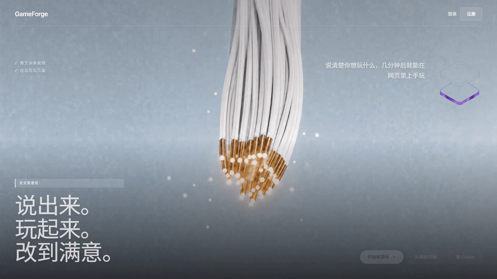
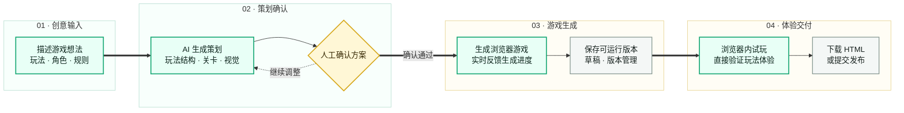
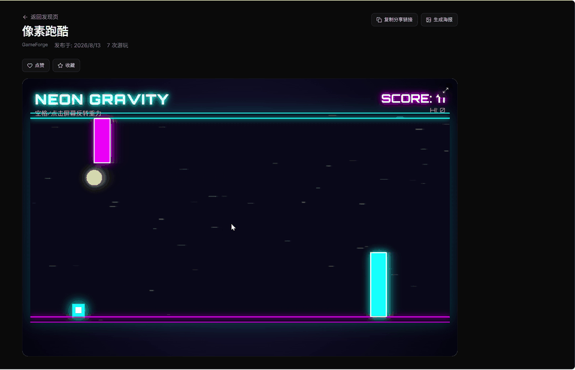
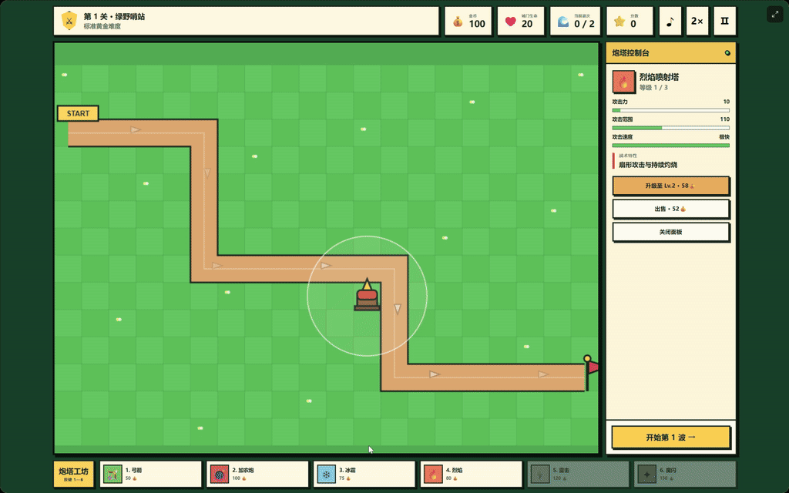
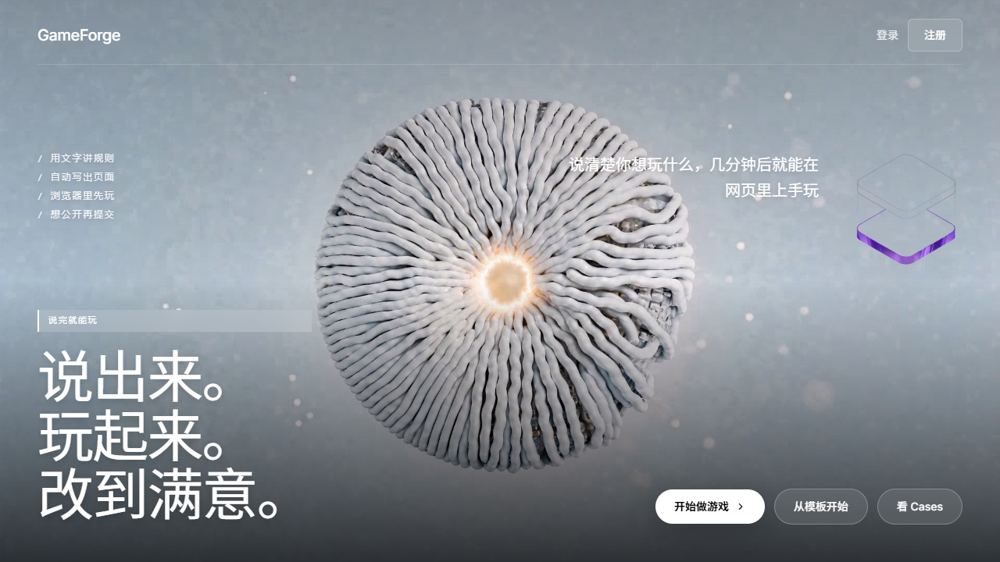
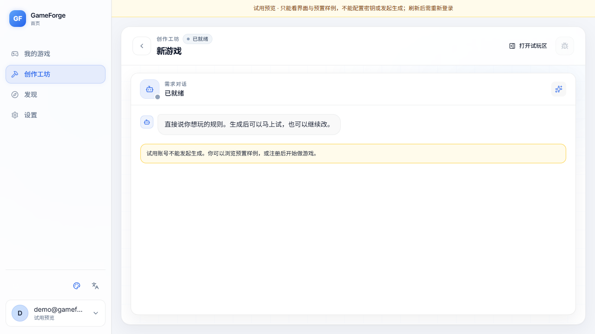
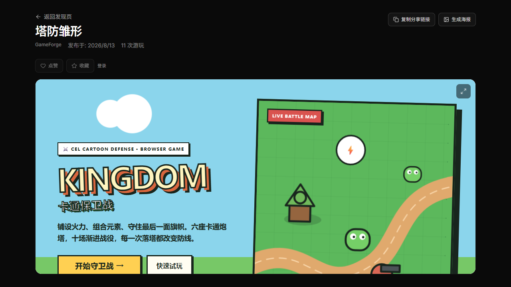

# GameForge

  <strong>简体中文</strong> · <a href="README.en.md">English</a>

> 用自然语言把一个浏览器游戏从想法推进到可试玩版本。

  

  <a href="docs/showcase/assets/gameforge-demo.mp4">查看开发游戏展示</a>
  &nbsp;·&nbsp;
  <a href="https://htmlpreview.github.io/?https://raw.githubusercontent.com/ByteTitan-star/GameForge-Copilot/docs/readme-redesign/docs/showcase/index.html">打开产品展示</a>

## GameForge 是什么

GameForge 是一个面向浏览器游戏的 AI 辅助创作工作区。创作者描述游戏想法后，可以查看 AI 策划、确认方案、生成游戏，并在浏览器内直接试玩。生成后的游戏还可以在游戏库中管理、下载或提交发布。

## 产品链路

| 阶段 | 关键动作 | 阶段结果 |
| --- | --- | --- |
| 创意输入 | 在 Forge 工作区用自然语言说明玩法、角色和规则。 | 清晰的玩法描述 |
| AI 策划 | 将创作意图整理为可查看、可确认的游戏设计。 | 结构化策划方案 |
| 人工确认 | 在生成前审阅设计方向，不满意可继续调整。 | 已确认的生成方案 |
| 游戏生成 | 将方案转化为可运行的浏览器游戏并反馈进度。 | 可管理的游戏版本 |
| 浏览器试玩 | 直接打开游戏，验证玩法与操作体验。 | 真实试玩反馈 |
| 下载或发布 | 下载独立 HTML，或提交进入发布流程。 | 可交付的游戏作品 |

## 开发游戏展示

### 像素跑酷

霓虹重力跑酷：空格或点击反转重力，避开障碍并累计分数。

### 塔防雏形

卡通塔防原型：放置防御塔、拦截敌人波次，并观察关卡进度。

## 产品界面

| 首页 | Forge 工作区 | 浏览器试玩 |
| --- | --- | --- |
|  |  |  |

三个界面分别展示创作入口、游戏设计工作区和浏览器试玩体验。

## 产品能力

- 自然语言描述游戏需求，获得 AI 游戏策划。
- 在生成前确认设计方向，掌握创作节奏。
- 自动生成可在浏览器运行的游戏版本，并提供进度反馈。
- 在游戏库中管理草稿、版本和公开作品。
- 支持浏览器试玩、独立 HTML 下载与发布流程。
- 支持收藏、点赞、分享和发现更多游戏作品。

## 开发游戏展示视频

本仓库附带的 [开发游戏展示视频](docs/showcase/assets/gameforge-demo.mp4) 展示像素跑酷和塔防作品在浏览器中的操作体验。

## 接下来

- 通过对话迭代已有游戏。
- 自定义角色、背景和音效素材上传。
- 更多游戏类型、模板与创作能力。

## 可视化展示页

打开[在线产品展示](https://htmlpreview.github.io/?https://raw.githubusercontent.com/ByteTitan-star/GameForge-Copilot/docs/readme-redesign/docs/showcase/index.html)，查看产品流程、开发游戏展示和界面体验，并可在页面右上角切换中文或 English。

## 许可证

[MIT](LICENSE)
