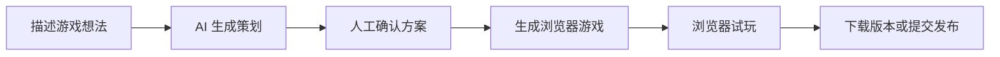

# GameForge

> 用自然语言把一个浏览器游戏从想法推进到可试玩版本。

<p align="center">
  <a href="https://htmlpreview.github.io/?https://raw.githubusercontent.com/ByteTitan-star/GameForge-Copilot/docs/readme-redesign/docs/showcase/index.html">
    
  </a>
</p>

<p align="center">
  <a href="docs/showcase/assets/gameforge-demo.mp4">观看游戏演示</a>
  &nbsp;·&nbsp;
  <a href="https://htmlpreview.github.io/?https://raw.githubusercontent.com/ByteTitan-star/GameForge-Copilot/docs/readme-redesign/docs/showcase/index.html">打开产品展示</a>
</p>

## GameForge 是什么

GameForge 是一个面向浏览器游戏的 AI 辅助创作工作区。创作者描述游戏想法后，可以查看 AI 策划、确认方案、生成游戏，并在浏览器内直接试玩。生成后的游戏还可以在游戏库中管理、下载或提交发布。

## 产品链路



| 步骤 | 体验 |
| --- | --- |
| 描述想法 | 在 Forge 工作区用自然语言说明玩法、角色和规则。 |
| AI 策划 | 获得结构化的游戏设计方案。 |
| 确认方案 | 在生成前查看并确认设计方向。 |
| 生成游戏 | 将设计转化为可运行的浏览器游戏。 |
| 浏览器试玩 | 直接打开游戏，观察并体验生成结果。 |
| 下载或发布 | 保存独立 HTML 版本，或提交到游戏库。 |

## 游戏 Demo

### 像素跑酷


霓虹重力跑酷：空格或点击反转重力，避开障碍并累计分数。

### 塔防雏形


卡通塔防原型：放置防御塔、拦截敌人波次，并观察关卡进度。

## 产品界面

| 首页 | Forge 工作区 | 浏览器试玩 |
| --- | --- | --- |
|  |  |  |

三个界面分别展示创作入口、游戏设计工作区和浏览器试玩体验。

## 产品能力

- 自然语言描述游戏需求，获得 AI 游戏策划。
- 在生成前确认设计方向，掌握创作节奏。
- 自动生成可在浏览器运行的游戏版本，并提供进度反馈。
- 在游戏库中管理草稿、版本和公开作品。
- 支持浏览器试玩、独立 HTML 下载与发布流程。
- 支持收藏、点赞、分享和发现更多游戏作品。

## 游戏演示

本仓库附带的 [游戏演示](docs/showcase/assets/gameforge-demo.mp4) 展示像素跑酷和塔防作品在浏览器中的操作体验。

## 接下来

- 通过对话迭代已有游戏。
- 自定义角色、背景和音效素材上传。
- 更多游戏类型、模板与创作能力。

## 可视化展示页

打开[在线产品展示](https://htmlpreview.github.io/?https://raw.githubusercontent.com/ByteTitan-star/GameForge-Copilot/docs/readme-redesign/docs/showcase/index.html)，查看产品流程、游戏 Demo 和界面体验。

## 开始使用

准备 Docker Desktop、Node.js、pnpm 与 [uv](https://docs.astral.sh/uv/)，然后：

```bash
cp backend/.env.example backend/.env
cp frontend/.env.example frontend/.env
docker compose up -d postgres redis rabbitmq

cd backend
uv sync
uv run alembic upgrade head
uv run python -m scripts.seed_official_games
```

分别启动后端服务和前端：

```bash
# 终端 1
cd backend
uv run uvicorn app.main:app --reload --host 127.0.0.1 --port 8000

# 终端 2
cd backend
uv run python -m app.messaging.worker

# 终端 3
cd frontend
pnpm install
pnpm run dev
```

打开前端地址，注册账号并在设置页配置可用的模型服务，即可体验完整创作流程。

更完整的环境变量、Docker 模式、排错与验证说明请见 [docs/development.zh-CN.md](docs/development.zh-CN.md)。

## 开发者入口

| 层 | 当前实现 |
| --- | --- |
| Web 客户端 | React、TypeScript、Vite |
| API | FastAPI |
| 数据与缓存 | PostgreSQL、Redis |
| 后台任务 | 异步任务与实时进度 |
| 生成编排 | 可配置的 AI 工作流 |
| 构建隔离 | 独立沙箱环境 |

## 项目结构

```text
frontend/          React 应用
backend/           后端服务与生成流程
contracts/         OpenAPI 契约与联调说明
docs/showcase/     产品展示页及媒体素材
docs/development*  开发与排错文档
```

## 参与贡献

请保持每个改动聚焦。涉及 API 的改动同步更新 OpenAPI 契约，涉及行为的改动补充针对性测试。

## 许可证

[MIT](LICENSE)
