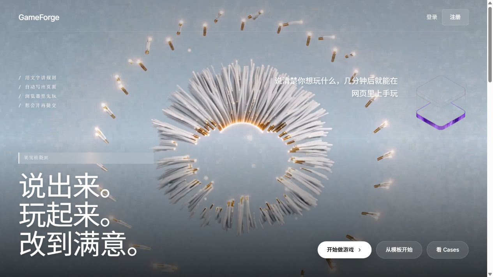
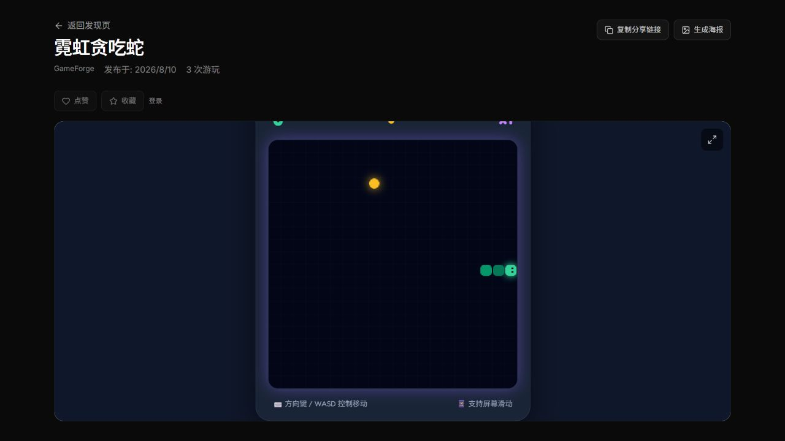

# GameForge-Copilot

[English](README.md) | [简体中文](README.zh-CN.md)

GameForge-Copilot is a self-hosted web workspace for turning a game idea into a playable HTML game. Describe the game in natural language, review the generated design, then play the result in your browser.



## Project introduction

The project combines a React workspace, a FastAPI backend, asynchronous workers, and a configurable LLM provider. It is designed for a human-in-the-loop workflow: the design plan is reviewed before the project proceeds to assets, code generation, sandbox checks, and browser playtesting.

## Gameplay demo

[](docs/assets/gameplay-demo.mp4)

The video records an actual local run: a game request, design confirmation, generation, browser preview, and gameplay.

## Core features

- Natural-language game requests with a structured design confirmation step.
- Live Forge progress through WebSocket events, with pause, resume, cancel, and retry controls.
- Built-in asset selection, HTML game generation, sandbox validation, and automated browser playtesting.
- Private draft previews, version history, version activation, and HTML version download.
- Publish submission and an administrator approval queue for public games.
- Official sample games that can be played without an LLM configuration and forked into a draft by verified users.
- Configurable OpenAI, Anthropic, and OpenAI-compatible providers, with per-user usage tracking.

## How it works

```text
Describe game
  -> Confirm design
  -> Generate game
  -> Play in browser
  -> Download or publish
```

The worker uses LangGraph to orchestrate planning, asset selection, code generation, and QA. Generated artifacts are stored by game version and served as standalone HTML previews.

## Screenshots

| Home | Playable game |
| --- | --- |
|  |  |

## Quick Start

### Prerequisites

- Docker Desktop with Docker Compose
- [uv](https://docs.astral.sh/uv/)
- Node.js 20+ and [pnpm](https://pnpm.io/)

### 1. Start dependencies

```bash
docker compose up -d postgres redis rabbitmq
```

### 2. Configure and initialize the backend

```bash
cp backend/.env.example backend/.env
cd backend
uv sync
uv run alembic upgrade head
uv run python -m scripts.seed_official_games
```

### 3. Run the API and worker in separate terminals

```bash
cd backend
uv run uvicorn app.main:app --reload --host 127.0.0.1 --port 8000
```

```bash
cd backend
uv run python -m app.messaging.worker
```

### 4. Run the frontend

```bash
cp frontend/.env.example frontend/.env
cd frontend
pnpm install
pnpm dev
```

Open [http://127.0.0.1:5173](http://127.0.0.1:5173). Confirm services are ready at [http://127.0.0.1:8000/ready](http://127.0.0.1:8000/ready).

Do not commit either `.env` file. After pulling a backend migration, run `cd backend && uv run alembic upgrade head` again.

## LLM configuration

1. Register and verify your account.
2. Open **Settings** and add an LLM configuration.
3. Choose OpenAI, Anthropic, or OpenAI Compatible; provide the model and API details required by that provider.
4. Mark one configuration as the default, then open Forge and start a game.

Credentials are encrypted by the backend and are never included in generated game artifacts. An LLM configuration is required for generation; the official sample games can be played without one.

## Architecture

```text
React + Vite
     |
FastAPI API <-> PostgreSQL / Redis / RabbitMQ
     |
Forge worker (LangGraph)
     |
LLM provider -> sandbox + browser playtest -> versioned HTML hosting
```

## Project structure

```text
backend/     FastAPI API, Forge graph, worker, migrations, and tests
frontend/    React + TypeScript application
contracts/   OpenAPI snapshot and integration contract notes
docker/      Backend, worker, and sandbox images
docs/        Product and engineering documentation
```

## Roadmap

- Generate a second game version from a follow-up change request.
- User-uploaded art and audio assets for generated games.
- Richer cover images and public game discovery.
- More deployment targets and operational tooling.

## Contributing

Create a branch from `main`, keep changes focused, and include tests for behavior changes. Before opening a pull request, run the relevant checks:

```bash
cd backend && uv run ruff check . && uv run pytest -q
cd frontend && pnpm test && pnpm lint && pnpm build
```

The API contract is generated at `contracts/openapi.json`; refresh it after API changes with `cd backend && uv run python -m app.export_openapi > ../contracts/openapi.json`, then run `cd frontend && pnpm gen:api`.

## License

This project is released under the [MIT License](LICENSE).
