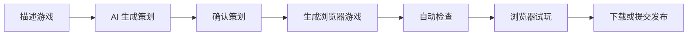

# GameForge

[English](README.md) | **简体中文**

<p align="center">
  <a href="docs/assets/readme/gameforge-demo.mp4">
    
  </a>
</p>

<p align="center">
  <strong>描述一个浏览器游戏，确认策划，生成游戏，并直接在浏览器中试玩。</strong>
</p>

## 产品演示

当前素材展示了产品首页，以及官方试玩库中已经可以打开和操作的游戏：

- **首页 GIF**：GameForge 中文首页的动态预览。
- **像素跑酷**：霓虹重力跑酷，包含键盘操作、跳跃、分数变化、失败和重新开始反馈。
- **塔防雏形**：可操作的塔防原型，包含防御塔放置、敌人波次和 Wave Clear 通关反馈。

点击观看[完整产品录制](docs/assets/readme/gameforge-demo.mp4)。视频重点展示真实的浏览器游戏试玩，不是从输入提示词到生成完成的等待过程。

## GameForge 是什么？

GameForge 是一个面向浏览器游戏的 AI 辅助创作工作区。创作者可以描述游戏想法、查看并确认生成的策划、生成独立的浏览器游戏，并且无需离开产品即可试玩结果。

当前产品还支持管理游戏草稿和版本、在隔离页面中预览生成版本、将本人拥有的版本下载为独立 HTML 文件，以及提交版本进入发布审核流程。

## 核心功能

- **自然语言创建游戏**：在 Forge 工作区描述游戏想法。
- **AI 策划与人工确认**：在构建前查看并确认生成的设计方案。
- **可玩游戏生成**：生成独立浏览器游戏，并执行自动检查。
- **浏览器预览与试玩**：在 GameForge 内打开私有草稿或已发布游戏。
- **持久化 Forge 对话**：重新进入游戏后仍可查看已有的 Forge 消息记录。
- **游戏版本下载**：将本人生成的版本下载为可独立打开的 HTML 文件。
- **发布和游戏库管理**：管理草稿、送审和已发布游戏，并通过审核工作流处理发布申请。
- **生成游戏封面**：Worker 环境启用浏览器试玩时，可使用试玩截图作为游戏封面。

## 工作流程



内部生成流程会完成游戏策划、内置素材选择、代码生成和结果校验。要在本地体验 Forge 生成流程，启动后请在设置页配置 LLM Provider；上方视频展示的是独立的浏览器试玩体验。

## 快速启动

### 前置条件

- Docker Desktop（包含 Docker Compose）
- Node.js 20+ 和 pnpm 9+
- [uv](https://docs.astral.sh/uv/)（会安装项目所需的 Python 3.12 运行时）

### 1. 创建本地配置

```bash
cp backend/.env.example backend/.env
cp frontend/.env.example frontend/.env
```

首次启动可保持本地默认值。不要提交 `.env` 文件。

### 2. 启动依赖并初始化后端

```bash
docker compose up -d postgres redis rabbitmq

cd backend
uv sync
uv run alembic upgrade head
uv run python -m scripts.seed_official_games
```

### 3. 启动 API、Worker 和前端

从仓库根目录打开三个终端：

```bash
# 终端 1
cd backend
uv run uvicorn app.main:app --reload --host 127.0.0.1 --port 8000
```

```bash
# 终端 2
cd backend
uv run python -m app.messaging.worker
```

```bash
# 终端 3
cd frontend
pnpm install
pnpm run dev
```

在浏览器打开 [http://127.0.0.1:5173](http://127.0.0.1:5173)。要生成游戏，先注册并完成邮箱验证，再在设置页填写可用的 LLM Provider。使用默认本地邮件配置时，验证码会输出在 Worker 终端中。

完整环境变量、Docker 后端模式、Windows 排错、健康检查和测试命令请见 [docs/development.zh-CN.md](docs/development.zh-CN.md)。

## 架构

| 层 | 当前实现 |
| --- | --- |
| Web 客户端 | React、TypeScript、Vite |
| API | FastAPI |
| 主数据 | PostgreSQL |
| 缓存与检查点 | Redis |
| 后台任务和实时事件 | RabbitMQ 与 Worker 进程 |
| 生成编排 | LangGraph |
| 模型调用 | 用户配置的 LLM Provider |
| 构建隔离 | 本地或 Docker Sandbox Backend；可选 Playwright 浏览器试玩与封面截图 |

## 项目结构

```text
frontend/   React 应用与浏览器端测试
backend/    FastAPI API、生成图、Worker、迁移和测试
contracts/  OpenAPI 契约与联调说明
docs/       开发文档和 README 媒体素材
```

## 开发文档

- [本地开发、配置和排错](docs/development.zh-CN.md)
- [API 契约与联调说明](contracts/INTEGRATION.md)
- [API 变更记录](contracts/CHANGELOG.md)

## 路线图

- [ ] 通过对话迭代已有游戏
- [x] 切换本人游戏到已有版本
- [ ] 上传自定义游戏素材
- [ ] 支持更多游戏类型和模板

路线图明确区分了规划中的功能与 `main` 分支当前已具备的能力。

## 参与贡献

请保持改动小而聚焦。API 变更需要同步更新 OpenAPI 契约，行为变更需要补充针对性测试，避免在同一个 Pull Request 中混入无关功能。开始本地开发前请阅读 [docs/development.zh-CN.md](docs/development.zh-CN.md)。

## 许可证

[MIT](LICENSE)
